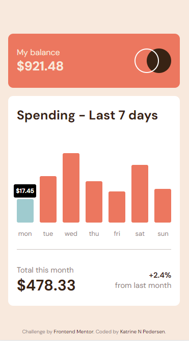
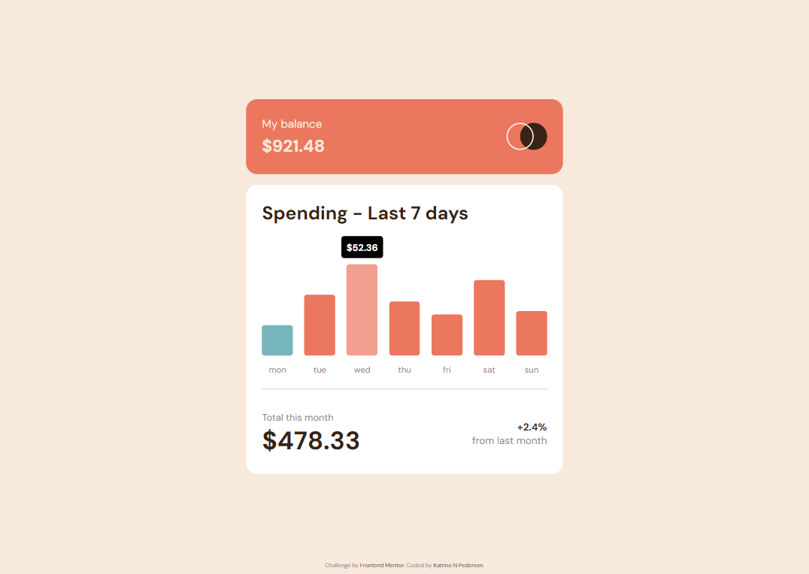

# Frontend Mentor - Expenses chart component solution

This is a solution to the [Expenses chart component challenge on Frontend Mentor](https://www.frontendmentor.io/challenges/expenses-chart-component-e7yJBUdjwt). Frontend Mentor challenges help you improve your coding skills by building realistic projects.

## Table of contents

- [Overview](#overview)
  - [The challenge](#the-challenge)
  - [Screenshot](#screenshot)
  - [Links](#links)
- [My process](#my-process)
  - [Built with](#built-with)
  - [What I learned](#what-i-learned)
  - [Continued development](#continued-development)
  - [Useful resources](#useful-resources)
- [Author](#author)

## Overview

### The challenge

Users should be able to:

- View the bar chart and hover over the individual bars to see the correct amounts for each day
- See the current day’s bar highlighted in a different colour to the other bars
- View the optimal layout for the content depending on their device’s screen size
- See hover states for all interactive elements on the page
- **Bonus**: Use the JSON data file provided to dynamically size the bars on the chart

### Screenshot

### Links

- Solution URL: [https://github.com/KatrineNPedersen/Expenses-Chart-Component.git]
- Live Site URL: [https://katrinenpedersen.github.io/Expenses-Chart-Component]

## My process

### Built with

- Semantic HTML5 markup
- Sass
- Flexbox
- CSS Grid
- Javascript
- Mobile-first workflow

### What I learned

In this challenge I learned how to incorporate a local JSON file to dynamically generate the bars and their labels based on the data. I was also able to create a much better structure using CSS grid for the daily spend bar graph

### Continued development

I will continue to work on integrating JSON files, as well as CSS grid in future challenges where applicable.

### Useful resources

- [JSON Tutorial for Beginners](https://www.youtube.com/watch?v=6OhMbf2v_jI) - This video was incredibly well explained and proved to be a great introduction to JSON and provided me with the necessary information to incorporate a local JSON file into the challenge.

## Author

- Frontend Mentor - [@KatrineNPedersen](https://www.frontendmentor.io/profile/KatrineNPedersen)
